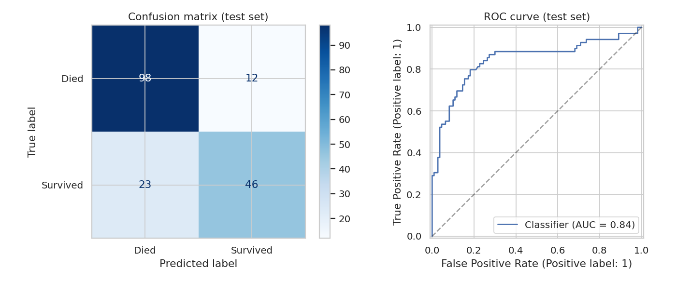
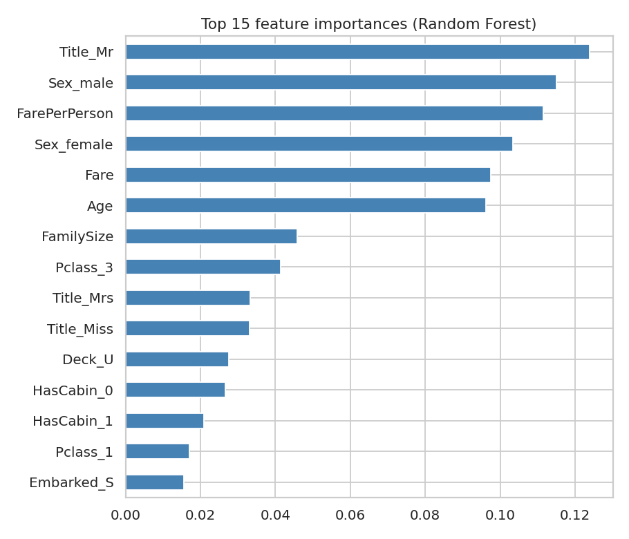

# Titanic Survival Prediction

Machine learning project that predicts whether a Titanic passenger survived, using the classic
Titanic dataset (891 passengers) and scikit-learn.

## Results

Evaluated on a stratified 20% hold-out test set (179 passengers) that was never used for tuning:

| Metric    | Score |
|-----------|-------|
| Accuracy  | 0.80  |
| ROC-AUC   | 0.84  |
| Precision (survived) | 0.79 |
| Recall (survived)    | 0.67 |

5-fold cross-validated accuracy on the training set: Logistic Regression 0.829, Gradient Boosting 0.824,
Random Forest 0.817 (0.836 after tuning). The models perform similarly; with only ~700 training rows,
the test-set number is noisy (roughly +/- 3 points).




## Approach

1. **EDA** - survival rate by sex, class, port, age and fare (`reports/figures/eda.png`).
2. **Feature engineering** (`src/features.py`)
   - `Title` extracted from the name (Mr, Mrs, Miss, Master, Rare)
   - `FamilySize`, `IsAlone`, `FarePerPerson`
   - `HasCabin` and `Deck` (cabin is ~77% missing, so missingness itself is informative)
3. **Preprocessing** - median imputation + scaling for numeric, mode imputation + one-hot for categorical.
   Everything lives inside one sklearn `Pipeline`, so imputation is fit only on training folds (no data leakage).
4. **Model selection** - compare Logistic Regression, Random Forest and Gradient Boosting with stratified 5-fold CV.
5. **Tuning** - `GridSearchCV` over Random Forest hyperparameters.
6. **Final evaluation** on the held-out test set.

## Project structure

```
titanic-survival-prediction/
├── data/Titanic-Dataset.csv
├── src/
│   ├── features.py     # feature engineering + preprocessing pipeline
│   ├── train.py        # train, tune, evaluate, save model
│   └── predict.py      # load the model and predict for a passenger
├── models/titanic_model.joblib
├── reports/
│   ├── metrics.json
│   └── figures/
├── requirements.txt
└── README.md
```

## Usage

```bash
python -m venv .venv && source .venv/bin/activate   # Windows: .venv\Scripts\activate
pip install -r requirements.txt

python src/train.py      # trains and saves model + reports
python src/predict.py    # demo prediction
```

Predict for your own passenger:

```python
import sys; sys.path.append("src")
from predict import predict

label, prob = predict({
    "Pclass": 3, "Name": "Smith, Mr. John", "Sex": "male", "Age": 30,
    "SibSp": 0, "Parch": 0, "Fare": 8.05, "Cabin": None, "Embarked": "S",
})
print(label, prob)
```

## Possible improvements

- Impute age using title-group medians
- Try XGBoost/LightGBM or a stacked ensemble
- Add ticket-group features (shared tickets often mean families)
